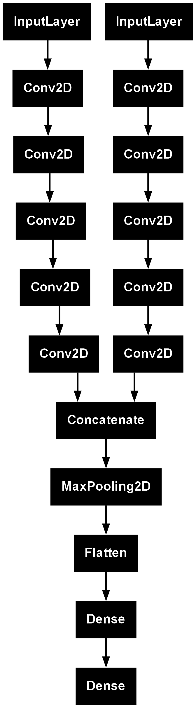

 # AUDIO-PROJECT
 

## Objective

The main objective of this project is to understand how deep learning techniques can be applied to audio data.
The core idea is to develop a guitar sound classifier, which will later be integrated into a reactive background game built with Pygame.

This project serves both as an exploration of audio machine learning pipelines and as a foundation for real-time interactive applications.

## Learning Outcomes

Through this project, the following concepts and tools are being explored:

- Librosa for audio processing and feature extraction
- Mel Spectrograms for audio representation
- Convolutional Neural Networks (CNNs) applied to audio classification
- Design and implementation of an audio processing pipeline
- Basic Mlflow

---

## V1

## Model 

### Architecture 

For the model, you can find the summary in `plots_model/double.txt`. The architecture consists of a dual-input deep learning model. The first input is the Mel spectrogram of the audio, and the second input is the Mel-frequency cepstral coefficients (MFCCs).

A Mel spectrogram can be represented as a 2D representation of the audio signal, while MFCCs are obtained by applying a Discrete Cosine Transform (DCT) to the log-Mel spectrogram. Since both features are two-dimensional structures, we can use 2D convolutional layers to extract relevant spatial and spectral patterns.

After an ascending sequence of five Conv2D layers, we concatenate both outputs and apply a MaxPooling layer to slightly reduce the dimensionality. We do not heavily rely on max pooling because the audio samples are already relatively short. Finally, the outputs are flattened and passed through a Dense layer for classification.

### Results

| Metric | Value |
|---|---:|
| Training Accuracy | 1.0000 |
| Training Loss | 0.000023 |
| Validation Accuracy | 0.9187 |
| Validation Loss | 0.3398 |
| Test Accuracy | 1.0000 |

The test accuracy may not be fully reliable because it was evaluated on a dataset that is very similar to the training data. However, the model still demonstrates strong generalization capabilities.

## Training Configuration

| Parameter | Value |
|---|---:|
| Target Length | 48000 |
| FFT Size (`n_fft`) | 1024 |
| Hop Length | 512 |
| Number of Mel Bands (`n_mels`) | 64 |
| Batch Size | 32 |

The target length is used for the envelope and padding functions. We selected a fixed duration of 4 seconds because the audio files were sampled at 16 000 Hz.

# Data-Source

- Vinci, F. (2019). Guitar Chords V2 [Data set]. Kaggle. https://www.kaggle.com/datasets/fabianavinci/guitar-chords-v2
- Adams, S. [Seth Adams]. (2025). Deep learning for audio classification [Playlist]. YouTube. https://www.youtube.com/playlist?list=PLhA3b2k8R3t2Ng1WW_7MiXeh1pfQJQi_P
- Veraldo, V. [Valerio Veraldo]. (2025). Audio signal processing for machine learning [Playlist]. YouTube. https://www.youtube.com/playlist?list=PL-wATfeyAMNqIee7cH3q1bh4QJFAaeNv0
